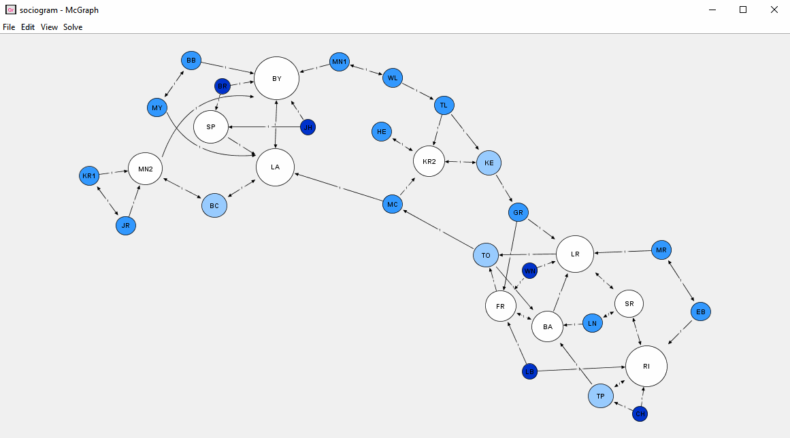

# McGraph Graph Editor

McGraph is a GUI program for editing and solving common graph-theory problems. It can find shortest distance paths, and perform graph coloring. All graphs without self-looping edges are supported.



This program was made for a 1-month assignment in Object Oriented Programming, so it was a collaborative project with [my lab partner](https://github.com/janaheit). The requirements for the assignment were quite simple and basic to implement, so we added a lot of extensions such as animations, the graph solver functionality, UI customization, etc. which actually turned this into a usable program.

## Features

### → directed and undirected edges

McGraph supports both directed and undirected edges. The graph solver will also work for both types of edges. 

You can toggle an edges direction by selecting it and then pressing the `direction toggle button` on the node tool bar.

### → weighed edges

McGraph supports arbitrary numeric edge weights. This includes negative weights, as well as fractional weights. The graph solver will work for any edge weight. Non-numeric edge weights are not supported.

The edge weights can be entered into the `edge weight field` and will set the edge weight of all selected edges. This field can be found on the edge tool bar when an edge is selected.

### → complex graphs including cycles, negative weights, or parallel edges

McGraphs fully supports graphs with cycles, negative weights, and parallel edges. This means that all solver operations will work on these graphs. The only kinds of graphs that are not supported are graphs containing [self looping](https://en.wikipedia.org/wiki/Loop_(graph_theory)) edges.

### → save and load graphs

Graphs can be saved and loaded from a custom file format (`.graph`). This format is completely lossless meaning graphs can be saved and loaded exactly as they are without any loss of information. Graphs can also be loaded from a "legacy" limited file format that is only supported because the assignment required it. However, this legacy format is lossy, visual customization of nodes and edges, as well as directionality of the edges cannot be saved.

Graphs can be saved and loaded from the `file` menu in the menu bar.

### → find shortest path between two nodes

The graph solver can be used for many useful operations on graphs, including the classic task of finding the shortest path between any two nodes on the graph. This is also done using the [Bellman-Ford algorithm](https://en.wikipedia.org/wiki/Bellman%E2%80%93Ford_algorithm), which can deal with edges with negative weights.

To use this feature, you must first mark the _start_ and _goal_ nodes of the graph by right clicking on the respective nodes and clicking the `Mark Start` and `Mark Goal` buttons. Then, right click and select `Find Shortest Path` from the pop-up menu. All nodes and edges along the shortest path will be highlighted. 

### → find the distance from one node to all other nodes

The graph solver can also find the distance of one node to all other nodes in a graph. This is also done using the [Bellman-Ford algorithm](https://en.wikipedia.org/wiki/Bellman%E2%80%93Ford_algorithm).

To use this feature, you must first mark the _start_ node for this operation by right clicking on the desired node and clicking the `Mark Start` button. Then, right click and select `Explore Graph` from the pop-up menu. All nodes and edges reachable from the _start_ node will be highlighted and marked with their distance to the _start_ node in parenthesis. 

### → graph coloring

Another useful feature of the graph solver is to perform [graph coloring](https://en.wikipedia.org/wiki/Graph_coloring). This will color all nodes in the graph such that no nodes that are connected by an edge share the same color. McGraph uses a [greedy graph coloring algorithm](https://en.wikipedia.org/wiki/Greedy_coloring) and uses heuristics to come up with a good node order. This means that graphs will _usually_ be colored with the smallest possible number of different colors, however, this is not _always_ the case. Even when the graph coloring isn't completely optimal, it usually comes pretty close.

To use this feature, right click anywhere on the graph and select `Color Graph` from the pop-up menu.

### → large degree of visual customization

Most visual aspects of nodes and edges can be customized. This includes the fill color, border color, and text color of nodes, the color of edges, the sizes and positions of nodes and edges, as well as the _styles_ of nodes and edges. 

The supported node styles include _rectangular_, _rounded_, _elliptic_, and the _diamond_ nodes.

The supported edge styles include _line_, _curve_, _spline_, and _elbow joint_ edges.

### → animated GUI

McGraph's GUI is mostly animated and responsive to user input, making it pretty intuitive. For example, when you select a node it will quickly blink to indicate that it is selected. When you hover over the button that changes the fill color of a node, that node's fill color will begin to flash to indicate what the button does.

Multiple nodes and edges can be selected by holding <kbd>CTRL</kbd> or <kbd>⌘</kbd> when clicking a node, or dragging a rectangle around the desired nodes to select. 

## Limitations

McGraph does not support [self looping edges](https://en.wikipedia.org/wiki/Loop_(graph_theory)). There is no way to create such edges.

Since performance wasn't a major concern during the development of this student project, McGraph does not perform very well on large (1000+ nodes and edges) graphs. One of the limitations of this assignment was that we could not multi-thread our program. This means that animations must also run on the main thread with the UI, which causes a lot of performance problems due to how we implemented the drawing.

Because we had to use MVC and the observer pattern, an animation playing on 1000 nodes will trigger the panel to redraw 60 × 1000 times per second. Even though the swing framework tries to coallesce duplicate draw requests, this still seems to be too much to handle.

The solver is still responsive and fully functional with 1000+ nodes, taking less than a second to execute.

## Requirements

[Java](https://www.java.com/en/download/) version 1.8 or higher.

## How to run

[Download]() `mcgraph.jar` then run: 

```bash
$ java -jar mcgraph.jar
```

To start the program with a particular graph run:

```bash
$ java -jar mcgraph.jar "dir/file.graph"
```

## Licence

This program and all of its source code are in the public domain, you can use them for anything you want. Enjoy :)
